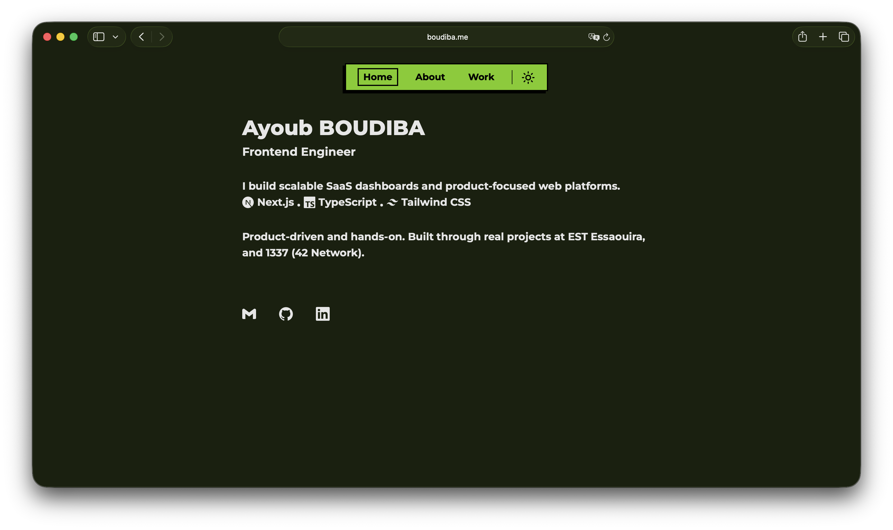

# Portfolio

A **neobrutalism-styled** Next.js + Tailwind portfolio, based on the [neobrutalism-templates/portfolio](https://github.com/neobrutalism-templates/portfolio) template. It uses bold borders, flat shadows, and a clear typographic hierarchy to present your work and experience.

---

## Features

### Multi-page structure

- **Home** (`/`) — Intro, tech stack, and social/contact links.
- **About** (`/about`) — Bio, skills by category, and work experience with dates and links.
- **Work** (`/work`) — Project cards with preview images and optional “Visit” / “Github” links.

Navigation is data-driven from `src/data/nav.ts`. The nav bar hides on scroll-down and shows on scroll-up for a cleaner reading experience.

### Theme (light / dark)

- **next-themes** powers a system-aware light/dark toggle.
- A theme switcher (sun/moon) lives in the nav; preference is persisted.
- All neobrutalism colors are defined as CSS variables in `src/app/globals.css` for both `:root` (light) and `.dark`, so the whole site respects the active theme.

### View transitions

- **next-view-transitions** is used for smooth page changes.
- Internal links use the library’s `<Link>` so route changes are animated instead of full reloads.

### About page: experience & skills

- **Experience** — Entries come from `src/data/experience.ts`. Each role has company (optional website link), role title, date range, and a description that supports multiple paragraphs (split by newlines).
- **Skills** — Categories and items are defined in `src/data/skills.ts`. Each skill has a name and an `iconKey` used by `SkillIcon` to show the correct Simple Icons icon. Tooltips show the skill name on hover. In development, the app can warn if a skill in the UI is not in the canonical resume list (`RESUME_SKILL_NAMES`).
- **Highlight** — The `<Highlight>` component in `src/components/ui/highlight.tsx` is used for emphasis in text (default marker style, or `border` / `subtle` variants).

### Work page: projects

- Projects are defined in `src/data/projects.ts`: `name`, `description`, `previewImage`, and optional `liveLink` and `repoUrl`.
- Each project is rendered as a card with an image (via Next.js `Image` and a fixed aspect ratio), description, and “Visit” / “Github” buttons when the URLs are set.

### Styling and UX

- **Neobrutalism** — Strong borders, offset box shadows, and `rounded-base` (0px) for a blunt, grid-like look. Custom design tokens (e.g. `--main`, `--border`, `--shadow`) drive the style.
- **Font** — Montserrat (Google Font) is applied in the root layout.
- **Animations** — `tw-animate-css` is used for entrance animations (fade-in, slide-in, zoom-in) with staggered delays on the About and Work pages.
- **Scrollbar** — Custom scrollbar colors for light and dark themes in `globals.css`.

---

## How it works

1. **Layout** (`src/app/layout.tsx`) — Wraps the app with `ViewTransitions`, `ThemeProvider`, and a fixed `Nav`. Page content is rendered in a constrained main area below the nav.
2. **Content** — Copy and structure live in the page components; reusable content (nav, projects, experience, skills, links) is driven by files in `src/data/` and components in `src/components/` and `src/components/sections/`.
3. **Routing** — Standard Next.js App Router: `src/app/page.tsx` (home), `src/app/about/page.tsx`, `src/app/work/page.tsx`. The nav uses `usePathname()` to highlight the active route.
4. **Icons** — Social/tech icons use `@icons-pack/react-simple-icons`; the About skills use a custom `SkillIcon` that maps `iconKey` to the correct Simple Icon.

### SEO & Google indexing

- **Sitemap** — `src/app/sitemap.ts` generates `/sitemap.xml` with Home, About, and Work (uses `NEXT_PUBLIC_SITE_URL`).
- **Robots** — `src/app/robots.ts` serves `/robots.txt` allowing all crawlers and pointing to the sitemap.
- To **show up on Google**: deploy the site, then go to [Google Search Console](https://search.google.com/search-console), add the property (e.g. `https://boudiba.me`), and submit the sitemap URL (`https://boudiba.me/sitemap.xml`). Use “URL inspection” → “Request indexing” for the homepage to speed up the first crawl.

---

## Get started

You can [create a new repo](https://github.com/neobrutalism-templates/portfolio/generate) from the original template, or clone this repo.

### Installation

This project uses **pnpm** (see `packageManager` in `package.json`). A `bun.lock` is also present, so you can use **bun** if you prefer.

```bash
pnpm i
# or
bun install
```

### Run locally

```bash
pnpm dev
# or
bun run dev
```

---

## Config

### Global

- **Metadata** — In `src/app/layout.tsx`, set `metadata` (e.g. `title`, `description`).
- **Favicon** — Replace `src/app/favicon.ico`.

### Home page

- **Copy** — Edit `src/app/page.tsx` (name, role, bio, tech stack array).
- **Links** — In `src/components/links.tsx`, edit the `links` array. Each entry needs `icon` (from `@icons-pack/react-simple-icons`) and `href`. Use the [Simple Icons](https://simpleicons.org/) site and import with the `Si` prefix (e.g. `SiGithub`).

### Nav

- **Routes** — Edit `src/data/nav.ts` (`NAV_LINKS`: `path` and `text`).

### About page

- **Experience** — Edit `src/data/experience.ts`. Each entry: `company`, `role`, `description` (multi-line string), `startDate`, `endDate`, optional `website`.
- **Skills** — Edit `src/data/skills.ts`. Adjust the `skills` object (categories and `{ name, iconKey }`). Keep `RESUME_SKILL_NAMES` in sync if you use the dev-only validation. Icon keys must match what `SkillIcon` supports (e.g. Simple Icons slug style).

### Work page

- **Projects** — Edit `src/data/projects.ts`. Each project: `name`, `description`, `previewImage`, optional `liveLink`, optional `repoUrl`.
- **Preview images** — Put assets in `public/` and set `previewImage` to `'/' + filename`, e.g. `previewImage: '/my-project.png'`.
- **Aspect ratio** — In `src/app/work/page.tsx`, the preview uses `<AspectRatio ratio={71 / 26}>`. Change the `ratio` prop if your images use a different aspect ratio (default assumes 710×260).

### Styling

- **Neobrutalism** — To change colors or tokens, edit `:root` and `.dark` in `src/app/globals.css`. For more options, see the [styling docs](https://neobrutalism.dev/styling) and copy the desired setup into your CSS.

---

## License

See [LICENSE](LICENSE).
